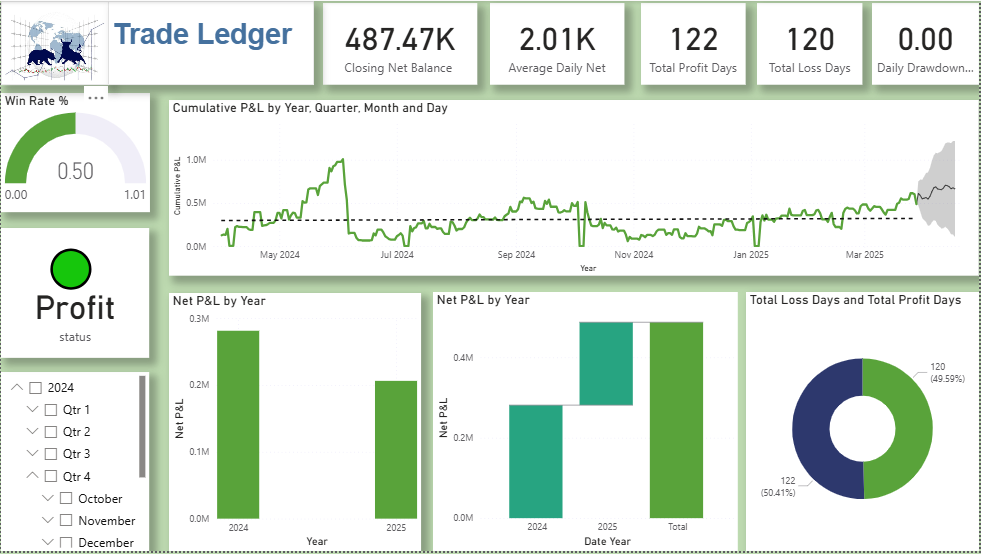
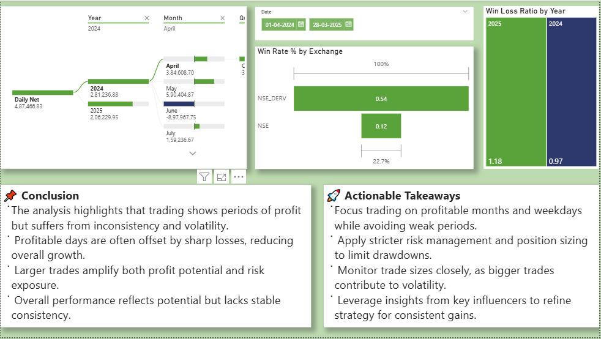

# 📊 Trade Ledger Performance Dashboard

Welcome to the Trade Ledger Dashboard—a dynamic, slicer-driven analytics tool designed to uncover trading patterns, performance trends, and strategic opportunities across exchanges and timeframes.

---

## 🧭 Explore the Dashboard

Use slicers to:
- Filter by **date range**, **exchange**, or **year**
- Compare **monthly performance**
- Analyze **win/loss ratios** and **net P&L**
- Visualize **cumulative growth** and **volatility**

---

## 🖼️ Dashboard Previews

### 📌 Overview Dashboard

### 📌 Exchange & Monthly Analysis

> 💡 Tip: Toggle slicers to reveal how KPIs shift across timeframes and exchanges.

---

## 🔍 What You'll Discover

### 📈 Performance Patterns
- Consistent daily net values across months
- Exchange-wise win rate comparison
- Volatility spikes and drawdown risks

### 📊 Strategic Insights
- Larger trades = higher potential, but greater risk
- Profitable days often offset by sharp losses
- Certain months consistently outperform others

---

## ✅ Actionable Takeaways

- Focus on **profitable months and weekdays**
- Apply **stricter risk management** and **position sizing**
- Monitor **trade sizes** to reduce volatility
- Use **influencer insights** to refine your strategy

---

## 🎥 Bonus Resources

- 📹 **Short Video Overview**: [Insert video link here]
- 🌐 **Live Dashboard Access**: [[Insert web report link here](https://app.powerbi.com/view?r=eyJrIjoiY2VjNjc4ZWUtOWEwYi00YmE1LTkzZTItZTA2MGYwZTk0MGYyIiwidCI6IjRjZjRmMmViLTliNDctNGNmMS1iZjRhLWIxZjcyZmUwNzM5ZSJ9)]

---

## 🔐 Data Privacy

> ⚠️ The raw trading data is personal and not included in this repository.  
All visuals and insights are based on private datasets.  
Feel free to use your own data or reach out for guidance on replicating the setup.

---

## 📁 How to Use

1. Clone or download the repository.
2. Open the dashboard images in `/assets`.
3. Use the README as a strategic guide.
4. Explore the live dashboard via the web link.

---

## 💬 Feedback & Collaboration

Have suggestions or want to collaborate?  
Open an issue or drop a message—I'd love to hear your thoughts!

---

**Disclaimer**: This analysis is based on historical data and does not constitute financial advice.

